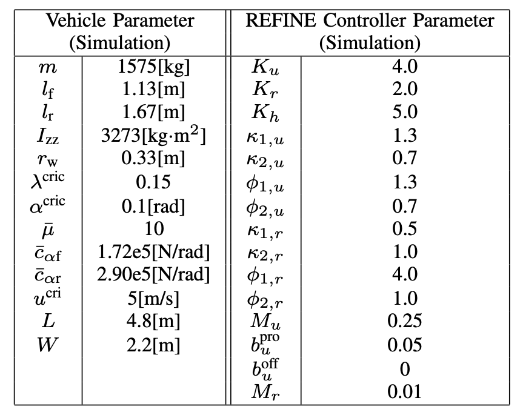

# REFINE
REFINE relis on Docker to run simulation. Note, simulation should be run in the MATLAB invoked by the provided docker image. See below for detail. 

## Installing Dependencies
* Install Docker Engine, following the instructions on the [Docker website](https://docs.docker.com/desktop/install/linux-install/).
* Download the following into the top-level [`util`](https://github.com/roahmlab/REFINE/tree/main/util) directory:
  * `coinhsl-2021.05.05.tar.gz` from [here](https://www.hsl.rl.ac.uk/ipopt/) (ACADEMIC LICENCE).
  * `lane_change_Ay_info.mat`, `dir_change_Ay_info.mat`, `car_frs.mat`, `car_frs.txt` from the data folder [here](https://drive.google.com/drive/folders/1WZbFFhCyhYQlMJxuV4caIzNoa-Q9VZkW?usp=share_link).
<!--
  * Clone the git repos and CORA by running the following from the top-level:
```bash
cd util
./download-dependencies.sh
```
-->

## Running the Simulation
* In this directory, run `./build-docker.sh`.
* Run `./run-docker.sh`.
* Run `./run-matlab.sh` in the docker. MATLAB needs to be activated at the first time when it runs in the docker. In case when MATLAB requires for an account verification but fails to automatically open a browser, try to log in your account and verify the account [online](https://matlab.mathworks.com/).
* Open another terminal, and get the 'CONTAINER ID' using `docker ps`. Run `docker exec -it replace_with_your_CONTAINER_ID /bin/bash` to enter the same running docker image, and run `./build-cpp-opt.sh` to build the necessary MEX file.
* In the MATLAB invoked by `./run-matlab.sh`, run [highway_simulation.m](https://github.com/roahmlab/REFINE/blob/main/Full_Size_Vehicle_Simulation/simulator/highway_simulation.m).

<!--
* In the docker:
  1. Run `./run-matlab.sh`. MATLAB needs to be activated at the first time when it runs in the docker. In case when MATLAB requires for an account verification but fails to automatically open a browser, try to log in your account and verify the account [online](https://matlab.mathworks.com/) 
  2. Run `./build-cpp-opt.sh` to build the necessary MEX file
  3. In MATLAB, open `JL_run_highway_simulation.m` and run the script
-->

## Vehicle and Control Parameters

The vehicle parameters used in simulation are summarized in the following figure along with controller gains that are chosen to satisfy the conditions in Lemma 14.

<figure>
<p align="center">
  
</p>
 </figure>
