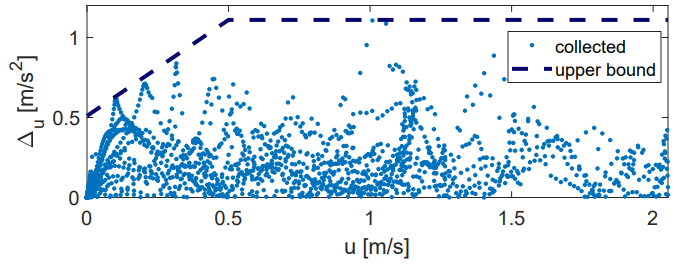

# REFINE
Low level controller is located in [fl_llc.h](https://github.com/roahmlab/REFINE/blob/main/Rover_Robot_Implementation/low-level-controller/src/rover_controller/include/fl_llc.h),   <!--`low-level-controller/src/rover_controller/include/fl_llc.h`-->
and online parameter generation is located in [param_gen.cc](https://github.com/roahmlab/REFINE/blob/main/Rover_Robot_Implementation/online-parameter-generation/src/rover_controller/src/param_gen.cc).     <!--`online-parameter-generation/src/rover_controller/src/param_gen.cc`-->

We summarize several components of the rover experiment here for interested readers. Note references to equations correspond to equation numbers from the paper.

## 1. Desired Trajectories 

An illustration of the speed change maneuvers described by (57), (58), and (60) can be found in Fig R.1 with $v_{\text{x},0}=1.0$ $[\text{m}/\text{s}]$, $v_{\text{x}}^{\text{cri}}=0.5$ $[\text{m}/\text{s}]$, $t_m=1.5$ $[\text{s}]$, and $a^{\text{dec}}=-1.5$ $[\text{m}/\text{s}^2]$.

<figure>

  
   <figcaption> <i> Fig. R.1 -  Examples of speed change maneuvers. Note zero lateral control is commanded in all 3 examples. </i> </figcaption>

 </figure>

An illustration of the direction change maneuvers described by (57), (58), and (61) can be found in Fig R.2 with $p_{v_\text{x}}=v_{\text{x},0}=1.0$ $[\text{m}/\text{s}]$, $t_m=1.5$ $[\text{s}]$, $h^{\text{des}}_1=\frac{20}{27}$, and $h^{\text{des}}_2=\frac{27}{10}$. 

<figure>

  
   <figcaption> <i> Fig. R.2 -  Examples of direction change maneuvers. </i> </figcaption>

 </figure>

## 2. Environment Sensing

We perform simultaneous localization and mapping (SLAM) using [Cartographer](https://ieeexplore.ieee.org/abstract/document/7487258) at a rate of 200Hz. Cartographer is a lidar based 2D SLAM algorithm that consists of a local sub-system, which builds locally consistent and successive submaps, and a global sub-system, which runs in background to achieve loop closure. Lidar scans are also used for obstacle detection at a rate of 10Hz using the method illustrated in [this paper](https://ieeexplore.ieee.org/document/8003904), which detects an object in the environment by multiple line segments. To account for estimation error as discussed in that paper, we inflate the detected line segments and convert them into zonotopes for online planning.

## 3. System Identification of Tire Models

The goal of system identification is to specify necessary parameters that describe the dynamics of the Rover.
Because parameters like mass, length, and moment of inertia can be directly measured, we focus on the identification of tire force related parameters including $\lambda^{\text{cri}}$, $\alpha^{\text{cri}}$, $\bar{\mu}$, $\bar{c}_ {\alpha\text{f}}$ and $\bar{c} _ {\alpha\text{r}}$, and explain how we generate the computational error $\Delta_{v_\text{x}}$, $\Delta_{v_\text{y}}$, $\Delta_r$ in (14) as well as their bounding parameters $b^{\text{pro}} _ {v_\text{x}}$, $b^{\text{off}} _ {v_\text{x}}$, $M_{v_\text{x}}$, $M_{v_\text{y}}$, and $M_r$ in the next subsection. Note this system identification is done by using a motion capture system; however, when REFINE is applied, the motion capture system is not used.

Recall the actual tire models in (6),(7), (10), and (11) become saturated at large slip ratios and slip angles. However, during experiments, the Rover is always expected to operate in linear regimes of tires by Assumption 3. Thus, to determine the tire force-related parameters of the Rover, we need to identify the critical slip ratio and critical slip angle at which tire force saturation begins, then fit linear tire models within the linear regimes. To identify the parameters related to longitudinal tire forces, the Rover executed a series of speed change maneuvers in a motion capture system to estimate $v_\text{x}$, $t_\text{y}$, and $r$. $\dot v_\text{x}$ is estimated using the onboard IMU.  Recall the ideal dynamics of longitudinal speed as in (4). By plugging in the speed information from the motion capture system, we generate the longitudinal tire force $F_x(t):=F_{x\text{f}}(t)+F_{x\text{r}}(t)$ that achieves the observed velocity trajectory. Because the Rover is AWD, both the front and the rear tires have the same tire speed and thus the same slip ratio, i.e. $\lambda_\text{f} = \lambda_\text{r}$.  Adding the two equations in (12) results in $F_x(t) = mg\bar\mu\lambda_\text{i}(t)$
where the subscript "i" can be replaced by either "f" for front tire or "r" for rear tire. Using the information from the encoder of driving motor and $v_\text{x}(t)$, slip ratios of both tires can be computed via (5). As shown in the Fig. R.3, the longitudinal tire force saturates when the slip ratio becomes bigger than $0.45$.

<figure>

  
   <figcaption> <i> Fig. R.3 -  System Identification on longitudinal tire force. A linear model is fit to data collected within the linear regime [-0.45,0.45] of slip ratio. </i> </figcaption>

 </figure>

Thus we set $\lambda^{\text{cri}}=0.45$ and fit $\bar\mu$ from $F_x(t) = mg\bar\mu\lambda_\text{i}(t)$ by performing least squares over collected data that satisfies $|\lambda_\text{i}(t)|\leq\lambda^{\text{cri}}$ at any time.  

To identify the parameters related to lateral tire forces, we follow a similar procedure and let the Rover execute a series of direction change maneuvers with various longitudinal speeds. Ground truth $v_\text{x}$, $v_\text{y}$, and $r$ are again estimated using the motion capture system, and $\dot v_\text{y}$ and $\dot r$ are estimated using the onboard IMU for all time. Recall when $v_\text{x}(t)> v_\text{x} ^{\text{cri}}$, the error-free dynamics of $v_\text{y}$ and $r$ are as in (4). One can then compute $F_\text{yf}(t)$ and $F_\text{yr}(t)$ by using the relevant components of (4) for $F_\text{yf}(t)$ and $F_\text{yr}(t)$. Using $v_\text{x}(t)$, $v_\text{y}(t)$, $r(t)$, and the steering motor input, one can compute slip angles for both tires via (8) and (9). As shown in Fig. R.4, the lateral tire force saturates when the slip angle becomes bigger than 0.165.

<figure>

  
  <figcaption> <i> Fig. R.4 - System identification on lateral tire forces. Linear models are fit using data collected within the linear regime [-0.165,0.165] of slip angles. </i> </figcaption>

 </figure>

Thus we set $\alpha^{\text{cri}}=0.165$, and fit $\bar c_{\alpha\text{f}}$ and $\bar c_{\alpha\text{r}}$ in (13) by performing least squares over collected data that satisfies $|\alpha_\text{i}(t)|\leq\alpha^{\text{cri}}$ at any time.   

## 4. System Identification on Modeling Error

Bounding parameters $M_{v_\text{x}}$, $M_{v_\text{y}}$, and $M_r$ are selected to be the maximum value of $|\Delta_{v_\text{x}}(t)|$, $|\Delta_{v_\text{y}}(t)|$, and $|\Delta_r(t)|$ respectively over all time. $b_{v_\text{x}}^\text{pro}$ and $b_{v_\text{x}}^\text{off}$ are generated by bounding $|\Delta_{v_\text{x}}(t)|$ from above when $v_\text{x}(t) \leq v_\text{x}^\text{cri}$. 

R.5 provides an illustration of the modeling error along the dynamics of $v_\text{x}$. Collected $\Delta_{v_\text{x}}(t)$ is bounded by $M_{v_\text{x}} = 1.11$ for all time. Whenever $v_\text{x}(t) \leq v_\text{x}^\text{cri} = 0.5$, $\Delta_{v_\text{x}}(t)$ is bounuded by $b_{v_\text{x}}^\text{pro}v_\text{x}(t) + b_{v_\text{x}}^\text{off}$ with $b_{v_\text{x}}^\text{pro} = 1.2$ and $b_{v_\text{x}}^\text{off} = 0.51$.

<figure>

  
  <figcaption> <i> Fig. R.5 - An illustration of the modeling error along the dynamics of longitudinal velocity.  </i> </figcaption>

 </figure>

## 5. Model Parameters

Results of system identification are summarized in Fig. R.6 together with controller gains that are chosen to satisfy the conditions in Lemma 14.

<figure>

  
  <figcaption> <i> Fig. R.6 - Rover model parameters and REFINE controller parameters. </i> </figcaption>

 </figure>
 
## 6. Controller Performance

An example of tracking performance of the proposed controller on the Rover with identified parameters is shown in Fig. R.7.

<figure>

  
  <figcaption> <i> Fig. R.7 - An illustration of the tracking performance of the Rover with the proposed controller and identified parameters in Fig. R.6. </i> </figcaption>

 </figure>
